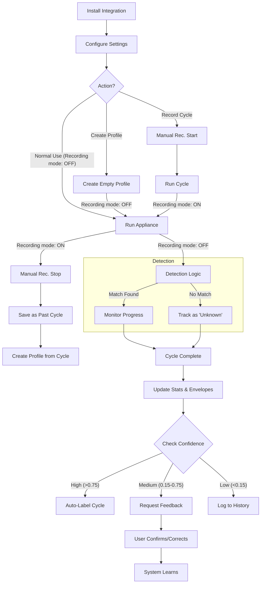
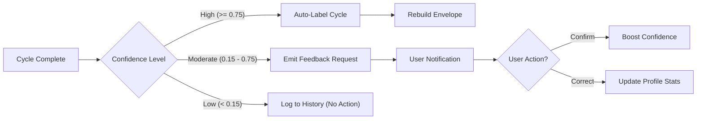

# HA WashData Implementation Guide

Note: Despite the name, HA WashData also works well for other appliances (e.g., dryers and dishwashers) as long as the power-draw cycle is reasonably predictable.

## Overview

This document covers the complete implementation of all major features:
1. Variable cycle duration support (±15%)
2. Smart progress management (100% on complete, 0% after unload)
3. Self-learning feedback system
4. Export/Import with full settings transfer
5. Auto-maintenance watchdog with switch control
6. Robust Cycle State Machine (vNext)
7. Reliability Features

---

## Table of Contents

- [Flows & Processes](#flows--processes)
- [Key Features](#features-implemented)
- [Key Classes & APIs](#key-classes--apis)
- [Event Flow](#event-flow)
- [Configuration](#configuration)
- [Deployment Notes](#deployment-notes)

---

## Flows & Processes

### 1. User Journey Flow
This high-level flow describes how a user interacts with the integration, from initial setup to daily use and feedback.



### 2. Event Processing Pipeline
How raw power sensor data is processed into cycle states.
 
 ```mermaid
 sequenceDiagram
     participant Sensor as Power Sensor
     participant Manager as WashDataManager
     participant Detector as CycleDetector
     participant Matcher as ProfileStore (Async)
     
     Sensor->>Manager: State Change (Power W)
     Manager->>Detector: process_reading(time, watts)
     
     rect rgb(20, 20, 20)
     Note over Detector: State Machine Logic
     Detector->>Detector: Check Gates (Start/End Energy)
     Detector->>Detector: Update State (OFF/RUNNING)
     end
     
     Detector-->>Manager: State Changed (e.g. STARTING -> RUNNING)
     
     loop Every 5 Minutes
         Manager->>Matcher: async_match_profile(current_data)
         Matcher->>Matcher: 3-Stage Pipeline (NumPy/DTW)
         Matcher-->>Manager: MatchResult (Best Profile, Confidence)
         Manager->>Manager: Update Estimations
     end
 ```
 
 ### 3. Cycle Detection State Machine
 The core finite state machine logic governing cycle lifecycle.
 
 ```mermaid
 stateDiagram-v2
     [*] --> OFF
     
     OFF --> STARTING: Power > Threshold
     STARTING --> RUNNING: Energy > Start_Threshold
     STARTING --> OFF: Power < Threshold (Spike)
     
     RUNNING --> PAUSED: Power < Threshold
     PAUSED --> RUNNING: Power > Threshold
     
     PAUSED --> ENDING: Time > Off_Delay
     RUNNING --> ENDING: Time > Off_Delay (rare)
     
     ENDING --> OFF: Energy < End_Threshold
     ENDING --> PAUSED: Energy > End_Threshold (False End)
     
     OFF --> [*]
 ```
 
 ### 4. Matching Pipeline (3-Stage)
 The logic used to identify which profile matches the current cycle.
 
 ```mermaid
 graph TD
     A[Raw Power Data] --> B["Resampling (10s intervals)"]
     B --> C{"Stage 1: Fast Reject"}
     C -- "Duration Ratio < 0.75 or > 1.25" --> D[Discard]
     C -- "Pass" --> E["Stage 2: Core Similarity"]
     
     E --> F["Calculate MAE, Correlation, Peak"]
     F --> G{"Ambiguous Result?"}
     
     G -- "No (Clear Winner)" --> H[Select Top Candidate]
     G -- "Yes (Close Scores)" --> I["Stage 3: DTW Refinement"]
     
     I --> J[Run Dynamic Time Warping]
     J --> H
     
     H --> K{"Confidence > Threshold?"}
     K -- Yes --> L[Match Confirmed]
     K -- No --> M["Unknown / Detecting..."]
 ```

### 5. Learning Mechanism (Feedback Loop)
How the system adapts to user corrections.




---

## Features Implemented

### 1. Variable Cycle Duration (±15%)

**Problem:** Real washers don't run for exact programmed times. Load size, water temperature, and soil level cause natural variance of 10-20%.

**Solution:** 
- Mock socket now simulates ±15% realistic duration variance
- Profile matching tolerates up to ±25% variance (was ±50%)
- Better real-world detection accuracy, fewer false negatives

**Files Modified:**
- `devtools/mqtt_mock_socket.py` - Added `--variability` argument for realistic duration variance.
- `custom_components/ha_washdata/profile_store.py` - Updated duration tolerance and matching logic.

**How It Works (Duration Filter):**
```python
# Profile matching logic (Initial Filter)
duration_ratio = actual_duration / expected_duration
# Accepts if within range (default: 0.75 - 1.25)
# This prevents comparing apples to oranges (e.g. 30min vs 2h cycles)
```

**Testing:**
```bash
python3 devtools/mqtt_mock_socket.py --speedup 720 --default LONG
# Watch for: [VARIANCE] Applied ±X.X% duration variance
```

---

### 1b. Cycle Status Classification (✓/⚠/✗)

**Why:** Distinguish natural completions from abnormal endings and restarts.

**Statuses:**
- ✓ `completed` — Natural finish after `off_delay` in low-power wait.
- ✓ `force_stopped` — Watchdog finalized while already in low-power wait; treated as success.
- ✗ `interrupted` — Abnormal early end: very short run or abrupt power cliff that never recovers.
- ⚠ `resumed` — Active cycle restored after HA restart.

**Logic:**
- Detector tracks low-power window and elapsed time; `force_end()` maps to `completed` when low-power wait ≥ `off_delay`, else `force_stopped` and `_should_mark_interrupted` can reclassify short/abrupt runs.

**UI & Scoring:**
- ✓ cases are considered successful; ✗ is flagged as abnormal; ⚠ retains reduced confidence.

---

### 2. Progress Reset Logic (100% → 0%)

**Problem:** Progress stayed stuck at last calculated value when cycle ended; no clear completion signal or unload time tracking.

**Solution:**
- Progress reaches 100% immediately when cycle completes (clear signal)
- Progress stays at 100% for 5 minutes (user unload time)
- After 5 min idle, progress automatically resets to 0%
- If new cycle starts within 5 min, reset is cancelled

**Files Modified:**
- `custom_components/ha_washdata/manager.py` - Complete implementation

**State Flow:**
```
RUNNING → COMPLETE
    ↓
Progress = 100% (cycle finished)
Start 5-min idle timer
    ↓
[Scenarios]
├─ New cycle starts within 5min → Cancel reset, progress → 0%
└─ 5min passes with no activity → Progress → 0% (unload complete)
```

**Implementation Details:**

| Component | Purpose |
|-----------|---------|
| `_cycle_completed_time` | Tracks when cycle finished (ISO timestamp) |
| `_progress_reset_delay` | Configurable idle time (default: 300s/5min) |
| `_start_progress_reset_timer()` | Begin countdown after cycle end |
| `_check_progress_reset()` | Async callback checking if idle threshold passed |
| `_stop_progress_reset_timer()` | Cancel reset if new cycle starts |

**Entity Updates:**
```yaml
# During cycle (0-100%)
sensor.washer_progress: "45"

# Cycle ends
sensor.washer_progress: "100"

# After 5 min idle
sensor.washer_progress: "0"
```

---

### 3. Self-Learning Feedback System

**Problem:** System couldn't learn from users or improve over time; no transparency about why cycles were detected a certain way.

**Solution:**
- Emit feedback request events for high-confidence matches
- Accept user confirmations or corrections via service call
- Learn from corrections (update profile durations conservatively)
- Track all feedback for history and review

**Files Created:**
- `custom_components/ha_washdata/learning.py` (208 lines) - New LearningManager class

**Files Modified:**
- `custom_components/ha_washdata/manager.py` - Integrated learning
- `custom_components/ha_washdata/__init__.py` - Service handler
- `custom_components/ha_washdata/const.py` - Constants

#### Feedback Request Flow

When a cycle completes with high-confidence match:

```yaml
Event: ha_washdata_feedback_requested
Payload:
  cycle_id: "abc123xyz"
  detected_profile: "60°C Cotton"
  confidence: 0.75
  estimated_duration: 60  # minutes
  actual_duration: 62     # minutes
  is_close_match: true
  created_at: "2025-12-17T15:30:00+00:00"
```

#### User Confirmation

Call service to confirm detection was correct:

```yaml
service: ha_washdata.submit_cycle_feedback
data:
  entry_id: "integration_entry_id"
  cycle_id: "abc123xyz"
  user_confirmed: true
  notes: "Perfect detection"
```

#### User Correction

Correct if the detected program was wrong:

```yaml
service: ha_washdata.submit_cycle_feedback
data:
  entry_id: "integration_entry_id"
  cycle_id: "abc123xyz"
  user_confirmed: false
  corrected_profile: "40°C Delicate"
  corrected_duration: 3300  # seconds
  notes: "Was actually a delicate cycle"
```

#### Learning Algorithm

When user corrects a cycle:
1. Store correction in feedback history
2. Update the corrected profile's average duration
3. Use conservative weighting: **80% old + 20% new**
4. Mark cycle with `feedback_corrected: true`
5. Future matches use updated profile

**Example:**
```python
# Original profile average: 3600s (60 min)
# User correction: 3300s (55 min)
# New average = (3600 * 0.80) + (3300 * 0.20)
#             = 2880 + 660
#             = 3540s (59 min)  # Gradual adjustment
```

**Why 80/20?** Prevents overfitting to single corrections. System learns gradually from consistent feedback.

#### Accessing Feedback Data

**Get pending feedback:**
```python
manager.learning_manager.get_pending_feedback()
# Returns: {cycle_id: {feedback_data...}}
```

**Get feedback history:**
```python
manager.learning_manager.get_feedback_history(limit=10)
# Returns: [{feedback_record}, ...] sorted by date desc
```

**Get learning statistics:**
```python
manager.learning_manager.get_learning_stats()
# Returns: {
#   "total_feedback": 5,
#   "confirmations": 3,
#   "corrections": 2,
#   "pending": 0
# }
```

### 4. Export/Import with Full Settings Transfer

**Problem:** Users needed to manually reconfigure all settings when setting up multiple devices or migrating to new instances.

**Solution:**
- Export all cycles, profiles, feedback history, AND all fine-tuned settings as JSON
- Import via UI (copy/paste, no filesystem needed) or file-based service
- Automatic orphaned profile cleanup during import
- Per-device isolation maintained via entry_id

**Files Modified:**
- `profile_store.py` - `export_data(entry_data, entry_options)`, `async_import_data(payload)` now handle config
- `config_flow.py` - New `async_step_export_import()` with JSON textarea
- `__init__.py` - Services updated to pass entry.data/options to export/import
- `strings.json` & `translations/en.json` - New UI labels and descriptions

**What's exported:**
```python
{
  "version": STORAGE_VERSION,
  "entry_id": "unique_id",
  "exported_at": "ISO timestamp",
  "data": {
    "profiles": {...},
    "past_cycles": [...],
    "feedback_history": [...]
  },
  "entry_data": {
    # power_sensor, name (device-specific - NOT imported)
  },
  "entry_options": {
    # ALL fine-tuned settings: min_power, off_delay, learning_confidence, etc.
  }
}
```

**UI Access:**
- Options → Diagnostics → Export/Import JSON
- Select "Export only" to copy JSON
- Select "Import from JSON" to paste exported data
- All settings automatically applied on import

**Service Usage:**
```yaml
service: ha_washdata.export_config
data:
  device_id: "washer_device_id"
  path: "/config/ha_washdata_export.json"

service: ha_washdata.import_config
data:
  device_id: "washer_device_id"
  path: "/config/ha_washdata_export.json"
```

### 5. Auto-Maintenance Watchdog

**Problem:** Deleted cycles left orphaned profile labels; fragmented runs cluttered history.

**Solution:**
- Nightly cleanup at midnight (configurable via switch)
- Removes profiles referencing deleted cycles
- Merges fragmented cycles (last 24h, max 30min gaps)
- Logs maintenance statistics
- User can toggle on/off via `switch.<name>_auto_maintenance`

**Files Created:**
- `switch.py` - New AutoMaintenanceSwitch entity (mdi:broom icon)

**Files Modified:**
- `profile_store.py`:
  - `cleanup_orphaned_profiles()` - Remove profiles with dead cycle references
  - `async_run_maintenance(lookback_hours, gap_seconds)` - Full maintenance run
- `manager.py`:
  - `_setup_maintenance_scheduler()` - Schedule midnight task
  - `_remove_maintenance_scheduler` - Cancel scheduler
  - Enhanced `async_shutdown()` to clean up scheduler
- `const.py` - Added `CONF_AUTO_MAINTENANCE`, `DEFAULT_AUTO_MAINTENANCE=True`
- `__init__.py` - Registered Switch platform

**Maintenance Workflow:**
```
Daily at 00:00
    ↓
ProfileStore.async_run_maintenance()
    ├─ 1. cleanup_orphaned_profiles()
    │  └─ Remove profiles referencing non-existent cycles
    ├─ 2. merge_cycles(lookback_hours=24, gap_seconds=1800)
    │  └─ Merge fragmented runs from past 24h (≤30min gaps)
    └─ 3. Save and log stats
```

**Switch Entity:**
- `switch.<name>_auto_maintenance` (default: ON)
- Toggle to enable/disable nightly cleanup
- When toggled, scheduler is re-setup accordingly
- Toggling OFF cancels scheduled cleanup

### 6. Robust Cycle State Machine (vNext)

**Problem:** Simple ON/OFF logic failed with pauses, soaking, or "Anti-Crease" modes.

**Solution:**
- Implemented a formal State Machine: `OFF` -> `STARTING` -> `RUNNING` <-> `PAUSED` -> `ENDING` -> `OFF`.
- **OFF**: Monitoring for `min_power`.
- **STARTING**: Debounce phase. Requires `start_duration_threshold` AND `start_energy_threshold` (e.g. 5Wh) to confirm.
- **RUNNING**: Main active state.
- **PAUSED**: Entered if power drops low but not long enough to end. Allows for soaking or door opening.
- **ENDING**: Candidates for completion. Must satisfy `off_delay` AND `end_energy_threshold` (e.g. < 50Wh in last window) to finish.

**Benefits:**
- Eliminates false starts from brief spikes.
- Prevents false endings during long pauses if energy was high recently.
- Handles "Anti-Crease" (periodic tumbles) gracefully via `PAUSED`/`ENDING` transitions.

### 7. Reliability Features

**Goal:** Improve precision for similar cycles and reduce "stuck" time estimates.

#### A. Confidence Boosting (Shape Matching)
**Problem:** Cycles with identical duration but different phases (e.g. Eco vs Intensive) were hard to distinguish.
**Solution:** If `numpy.corrcoef` > 0.85 (very strong shape match), the profile match score is heavily boosted (x1.2), allowing strict shape matching to override minor power amplitude differences.

#### B. Smart Time Prediction (Variance Locking)
**Problem:** Time remaining jumped erratically during variable phases (e.g. heating water).
**Solution:**
- System calculates standard deviation (variance) of the matched profile window.
- If variance is high (>50W std dev): Time estimate updates are **damped** (locked).
- If variance is low: Time estimate updates normally.
- **Switching Logic**: System switches profile mid-cycle if:
    - New match confidence > Existing score + 0.15 (Strong override)
    - New match shows positive trend (>70% increasing scores)
 
#### C. Smart Termination & End Spike Logic
**Problem:** Dishwashers often have a long silent drying phase followed by a brief, high-power pump-out spike. Smart termination would sometimes cut the cycle off early (during drying), missing the final spike and causing the spike to trigger a new "ghost" cycle.

**Solution:**
- **Conservative Ratio**: Dishwashers require **99%** of expected duration before Smart Termination is even considered (vs 98% for others).
- **End Spike Wait Period**: Even if the duration is met, the system scans the "Ending" state for a high-power spike.
- If no spike is found, it **waits up to 5 extra minutes** past the expected duration to catch it.
- **Ghost Cycle Suppression**: A "Suspicious Window" (20 mins) protects legitimate short cycles. Aggressive ghost cycle termination (10 min timeout) only applies if a cycle starts within 20 mins of the previous one ending.
- **Persistence**: This 20-minute window logic persists across Home Assistant restarts by restoring `_last_cycle_end_time` from the persistent `profile_store`, ensuring protection isn't lost after a reboot.
- **Tail Preservation**: The profile store now explicitly preserves trailing silence/spikes for natural completions, preventing the "profile shrinking" feedback loop where frequent early terminations made the learned profile shorter and shorter.
 

 
---

## Key Classes & APIs

### WashDataManager (manager.py)

**Main entry point for cycle management.**

| Method | Purpose |
|--------|---------|
| `async_setup()` | Initialize, load state, setup listeners |
| `async_shutdown()` | Cleanup, save state |
| `_async_power_changed(event)` | Handle power sensor updates |
| `_update_estimates()` | Match profiles, set entities (every 5 min) |
| `_on_state_change(old, new)` | Handle detector state transitions |
| `_on_cycle_end(cycle_data)` | Finalize cycle, request feedback |
| `_start_progress_reset_timer()` | Begin 5-min reset countdown |
| `_check_progress_reset()` | Async callback checking if idle threshold passed |
| `_stop_progress_reset_timer()` | Cancel reset if new cycle starts |
| `_maybe_request_feedback()` | Emit feedback request if confident |

**Properties:**
```python
manager.learning_manager  # LearningManager instance
manager._last_match_confidence  # Last profile match score
manager._cycle_completed_time  # When cycle finished (ISO)
```

### LearningManager (learning.py)

**Handles user feedback and profile learning.**

| Method | Purpose |
|--------|---------|
| `request_cycle_verification(cycle_data, confidence)` | Flag cycle for user verification |
| `submit_cycle_feedback(cycle_id, user_confirmed, corrected_profile, corrected_duration, notes)` | Accept user input |
| `_apply_correction_learning(profile_name, corrected_duration)` | Update profile (80%/20% weighting) |
| `get_pending_feedback()` | Return cycles awaiting input |
| `get_feedback_history(limit=10)` | Return recent feedback |
| `get_learning_stats()` | Return learning metrics |

### ProfileStore (profile_store.py)

**Manages cycle storage, compression, and profile matching.**

| Method | Purpose |
|--------|---------|
| `async_match_profile(power_data, duration)` | Match cycle to profile (confidence 0-1) |
| `create_profile(name, cycle_id)` | Create new profile from cycle |
| `async_save_cycle(cycle_data)` | Compress and save cycle |
| `merge_cycles(hours, gap_threshold)` | Auto-merge fragmented cycles |

**Duration Matching:**
- Tolerance: ±25% (was ±50%)
- Rejects: duration_ratio < 0.75 or > 1.25
- Accounts for realistic variance
