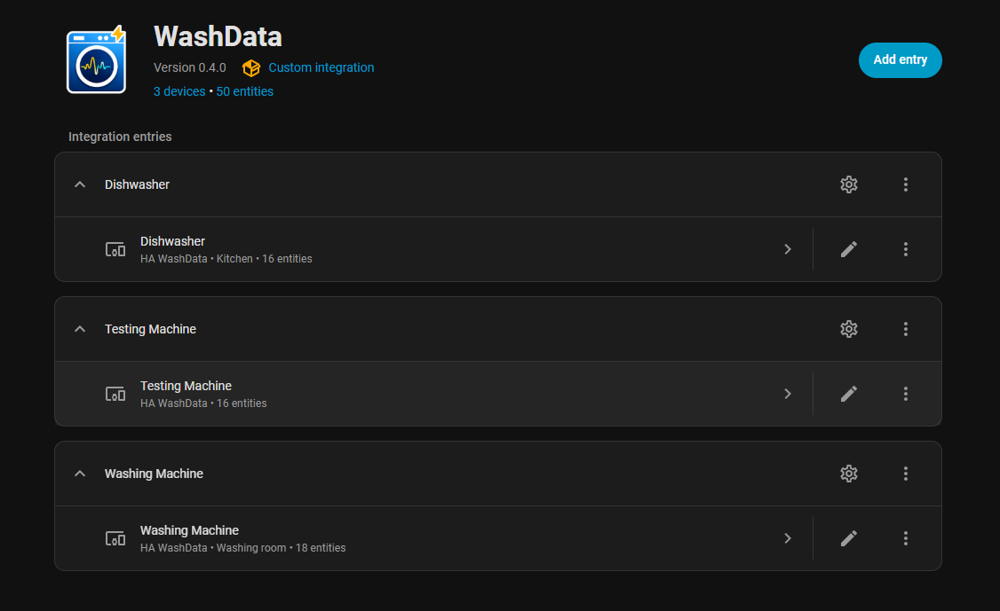
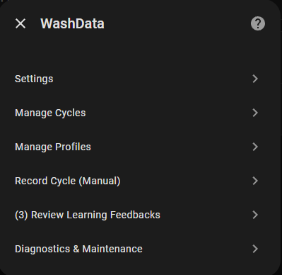
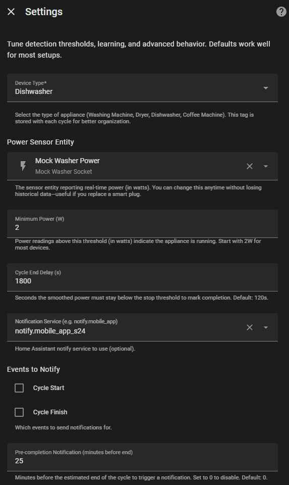
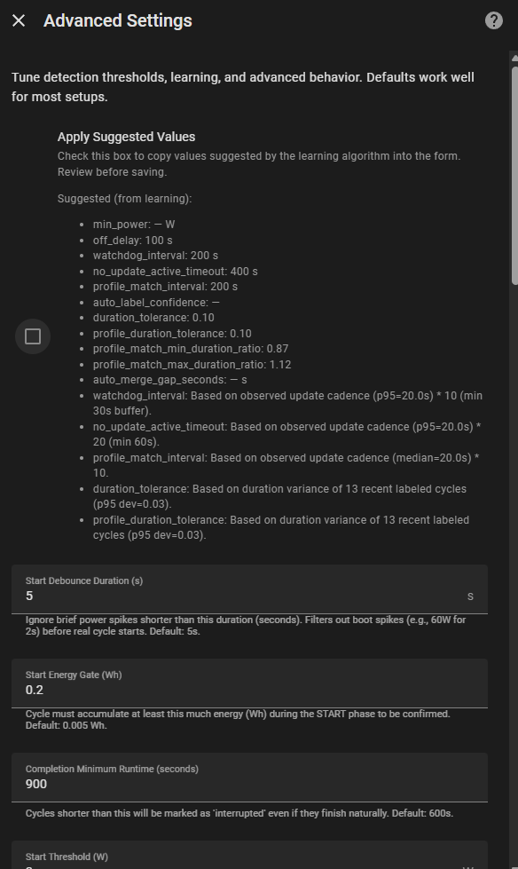
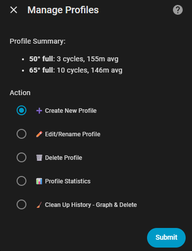
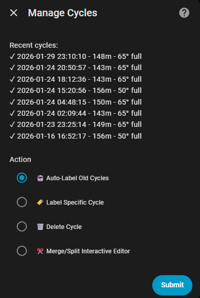
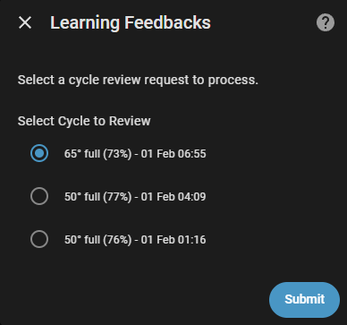
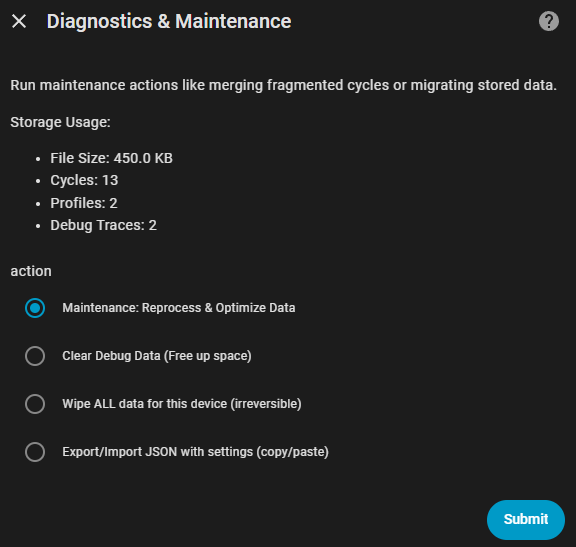

> [!WARNING]  
> **2026/01/29 - CURRENTLY NOT ACCEPTING PRs OR NEW ISSUES**: I'm currently refactoring entire logic of the integration. Your PRs will be rejected. Look into existing Issues and comment on the issue if its applicable, dont create new duplicate Issues.


[](https://ko-fi.com/3dg1luk43)

# HA WashData Integration

A Home Assistant custom component to monitor washing machines via smart sockets, learn power profiles, and estimate completion time using shape-correlation matching.

> [!CAUTION]  
> **ELECTRICAL SAFETY WARNING**: Using smart plugs such as Shelly or Sonoff with high-amperage appliances (washing machines, dryers, dishwashers) carries significant risk.  
> 
> *   **Fire Hazard**: Cheap or low-rated smart plugs may overheat, melt, or catch fire under sustained high loads (heating/drying phases).  
> *   **Rating Check**: Ensure your smart plug is rated for the **maximum peak power** of your appliance (often >2500W). Standard 10A plugs may fail; 16A+ or hardwired modules are recommended.  
> *   **Use at Your Own Risk**: The authors of this integration are not responsible for any electrical damage or fires caused by improper hardware usage. inspect your hardware regularly.

## ✨ Features

- **Multi-Device Support**: Track Washing Machines, Dryers, Dishwashers, or Coffee Machines with device-type tagging.
- **Smart Cycle Detection**: Automatically detects starts/stops with **Predictive End** logic. Includes **End Spike Protection** for dishwashers to capture final pump-outs.
- **Power Spike Filtering**: Ignores brief boot spikes to prevent false starts.
- **Shape-Correlation Matching**: Uses `numpy.corrcoef` with **Confidence Boosting** to distinguish similar cycles.
- **Manual Training**: You define your profiles (e.g., "Cotton", "Quick") once; the system learns to recognize them thereafter. Integration **does not** auto-create profiles.
- **Smart Time Estimation**: "Phase-aware" prediction detects variance (e.g., heating) and locks the countdown to prevent erratic jumps.
- **Changeable Power Sensor**: Switch plugs without losing history.
- **Minimal Status Card**: Optional custom Lovelace card.
- **Manual Program Override**: Select the correct program manually if detection is uncertain; the system learns from your input.
- **Manual Profile Creation**: Create profiles even without historical cycles by specifying a baseline duration (e.g., "Eco Mode - 3h").
- **Ghost Cycle Suppression**: Intelligent filtering with **"Suspicious Window"** (20 mins) prevents end-spikes from triggering duplicate cycles. **Now Persistent**: Remembers cycle history across HA restarts to prevent ghost detections after reboots.
- **Robust vNext State Machine**: Advanced filtering with `start_energy` and `end_energy` gates prevents false starts/ends.
- **Multi-Stage Matching Pipeline**: Uses Fast Reject -> Core Similarity -> DTW-Lite tie-breaking for superior accuracy.
- **Local Only**: No cloud dependency, no external services. All data stays in your Home Assistant.
- **Notifications**: Integrated alerts for cycle start, finish, and **pre-completion** (e.g., 5 mins before finish).
- **Self-Learning**: Gradually adjusts expected durations based on your confirmed historical data.
- **Realistic Variance**: Handles natural cycle duration variations with configurable tolerance.
- **Progress Tracking**: Clear cycle progress indicator with automatic reset after unload.
- **Auto-Maintenance**: Nightly cleanup - removes broken profiles, merges fragmented cycles (**Empty/New profiles are safely preserved**).
- **Export/Import**: Full configuration backup/restore with all settings and profiles via JSON.

---

## 📘 Basic User Guide

Designed for new users to get up and running quickly.

## 1. Installation

### Option A: HACS (Recommended)
This integration is a default repository in HACS.

1. Click the button below to open the repository in HACS:
   [](https://my.home-assistant.io/redirect/hacs_repository/?owner=3dg1luk43&repository=ha_washdata&category=integration)
2. Click **Download**.
3. Restart Home Assistant.

*Alternatively, open HACS > Integrations > Explore & Download Repositories > Search for "WashData".*

### Option B: Manual Installation
1. Download the `custom_components/ha_washdata` folder from the [latest release](https://github.com/3dg1luk43/ha_washdata/releases).
2. Copy it to your Home Assistant `custom_components` directory.
3. Restart Home Assistant.


---

## ⚡ Getting Started (The "Happy Path")

Follow these steps to get accurate results quickly.

### 1. Initial Setup
1. Go to **Settings > Devices & Services** > **Add Integration** > **WashData**.
2. **Name**: Name your appliance (e.g., "Washing Machine").
3. **Device Type**: Select the type (Washer, Dryer, etc.) - this sets smart defaults for the internal logic.
4. **Power Sensor**: Select your smart plug's power entity (Watts). *Note: The system is now optimized for polling intervals of 30-60 seconds (defaults adjusted automatically).*
5. **Initial Profile (Optional)**: If you know your standard program (e.g. "Cotton"), create it now.

### 2. The Golden Rule: "Teach" the Integration
WashData **does not** come with pre-built profiles because every machine model is different. You must teach it what your cycles look like.

#### Option A: Manual "Record Mode" (Recommended)
This gives you the cleanest data.
1. Open the **Dashbord Card**.
2. Select **Record Cycle (Manual)** from the program list.
3. Start your machine.
4. When finished, go to **Manage Data & Profiles**, find the recording, and create a profile.

#### Option B: The Natural Way
If you prefer to just use it and label later:
1. **Run a Cycle**: Use your machine as normal. WashData will track it as an "Unknown" cycle.
2. **Label It**: After the cycle finishes:
   - Go to **Manage Data & Profiles** (via the Configure button or the Tile Card).
   - Find the recent "Unknown" cycle.
   - Click **Create Profile**, name it (e.g., "Cotton 40"), and Save.
3. **Repeat**: Do this for your 2-3 most common programs.

### 3. Verification & Learning
Once profiles are created, WashData starts **matching** new cycles automatically.
- **Feedback**: If a match is found but confidence is moderate, you may get a "Verify Cycle" notification.
- **Refinement**: Go to **Configure > Learning Feedbacks** to Confirm or Correct the detection.
- **Self-Improving**: Confirming a cycle helps the system refine its duration models.

---

## 🔧 Troubleshooting & Tuning

If "Auto-Detect" isn't working perfectly, use **Advanced Settings** to tune the logic for your specific machine.

> 📊 **[Click here for a Visual Guide to these settings](SETTINGS_VISUALIZED.md)** - Graphs explaining what the numbers actually do.

| Problem | Likely Cause | Solution |
| :--- | :--- | :--- |
| **Cycle Starts Too Early** | Smart plug reports brief power spikes during boot/standby. | **Increase `Start Energy Threshold`** (e.g., to `2 Wh`). This forces the machine to consume actual energy before stating "Running". |
| **Cycle Ends Too Early** | Machine pauses (soaking) or has long low-power intervals. | **Increase `Off Delay`**. Give it more time (e.g. 5 mins) to wait before deciding the cycle is truly finished. |
| **False "Ghost" Cycles** | High-power usage at the very end (e.g. anti-crease or pump-out) triggers a new start. | **Increase `Minimum Off Gap`** (e.g. to `120s`). Forces a mandatory cooldown period between cycles. |
| **"Unknown" Matches** | Your profiles are too strict or variance is high. | **Increase `Duration Tolerance`** (e.g. `0.25`). Allows ±25% duration difference when matching. |
| **Notifications Too Late** | You want to know *before* it finishes. | **Set `Notify Before End Minutes`** (e.g. `5`). Get an alert 5 minutes before the estimated finish time. |

> **Pro Tip**: Use the **Apply Suggestions** button in Settings. It analyzes your history and calculates the perfect text-book values for your specific machine.

---

## 📊 Documentation & References

- 📗 **[IMPLEMENTATION.md](IMPLEMENTATION.md)** - Deep dive into NumPy matching, State Machine logic, and Learning algorithms.
- 🧪 **[TESTING.md](TESTING.md)** - How to test with the virtual socket.

<details>
<summary>📸 <b>Screenshots</b> (Click to expand)</summary>

#### Devices Overview
All your WashData-monitored appliances appear as devices with sensors and controls.


#### Main Menu
The central hub for managing your appliance - access all features from here.


#### Basic Settings
Configure power sensor, device type, off delay, and notification preferences.


#### Advanced Settings
Fine-tune detection thresholds, matching parameters, and timeout values for your specific appliance.


#### Manage Profiles
View, create, edit, or delete learned power profiles for different wash programs.


#### Manage Cycles
Browse cycle history, label unknown cycles, merge fragments, or delete bad data.


#### Review Feedback
Confirm or correct the system's profile matches to improve learning accuracy.


#### Diagnostics & Maintenance
Run database cleanup, repair corrupted data, and export/import configurations.


</details>

### Entities Provided
- **`sensor.<name>_state`**: Current Status (Idle, Running, Detecting...).
- **`sensor.<name>_program`**: Best-matched Profile Name.
- **`sensor.<name>_time_remaining`**: Smart countdown (locks during high variance phases).
- **`sensor.<name>_cycle_progress`**: 0-100% (Resets to 0% after unload timeout).
- **`binary_sensor.<name>_running`**: Simple On/Off state.
- **`switch.<name>_auto_maintenance`**: toggle nightly database cleanup.

### Services
Most management is now done via the **Interactive UI** (Configure > Manage Data), but services are available for automation:
- `ha_washdata.export_config`: Full JSON backup/restore.
- **`ha_washdata.import_config`**: Import a JSON backup, restoring all custom thresholds and profiles.

**`ha_washdata.record_start` / `record_stop`**:
Manually start/stop a recording. Useful for automations (e.g. triggering from a physical button or separate sensor).
```yaml
service: ha_washdata.record_start
data:
  device_id: "washer_device_id"
```
- `ha_washdata.label_cycle`: Assign profile to history programmatically.

## License
Non-commercial use only. See [LICENSE](LICENSE) file.
