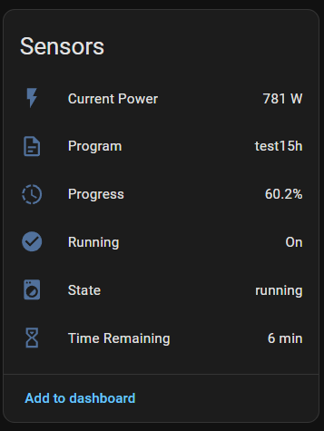
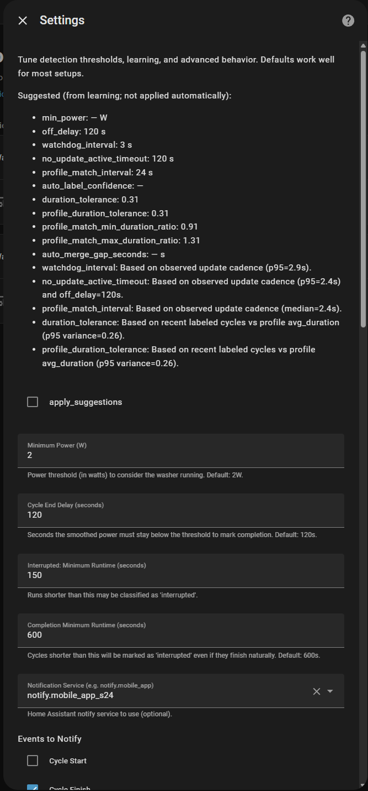
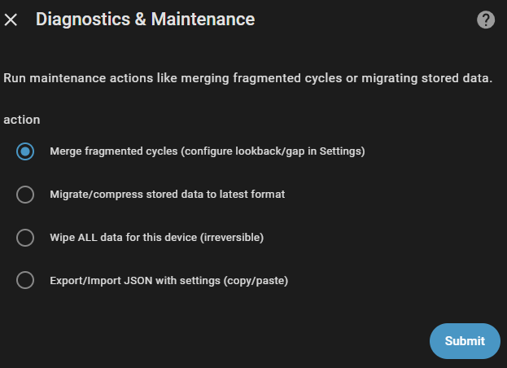

[](https://ko-fi.com/3dg1luk43)

# HA WashData Integration

A Home Assistant custom component to monitor washing machines via smart sockets, learn power profiles, and estimate completion time using shape-correlation matching.

> [!CAUTION]  
> **ELECTRICAL SAFETY WARNING**: Using smart plugs such as Shelly or Sonoff with high-amperage appliances (washing machines, dryers, dishwriters) carries significant risk.  
> 
> *   **Fire Hazard**: Cheap or low-rated smart plugs may overheat, melt, or catch fire under sustained high loads (heating/drying phases).  
> *   **Rating Check**: Ensure your smart plug is rated for the **maximum peak power** of your appliance (often >2500W). Standard 10A plugs may fail; 16A+ or hardwired modules are recommended.  
> *   **Use at Your Own Risk**: The authors of this integration are not responsible for any electrical damage or fires caused by improper hardware usage. inspect your hardware regularly.

## ✨ Features

- **Multi-Device Support**: Track Washing Machines, Dryers, Dishwashers, or Coffee Machines with device-type tagging.
- **Smart Cycle Detection**: Automatically detects starts/stops with **Predictive End** logic to finish faster when confidence is high.
- **Power Spike Filtering**: Ignores brief boot spikes to prevent false starts.
- **Shape-Correlation Matching**: Uses `numpy.corrcoef` with **Confidence Boosting** to distinguish similar cycles.
- **Manual Training**: You define your profiles (e.g., "Cotton", "Quick") once; the system learns to recognize them thereafter. Integration **does not** auto-create profiles.
- **Smart Time Estimation**: "Phase-aware" prediction detects variance (e.g., heating) and locks the countdown to prevent erratic jumps.
- **Changeable Power Sensor**: Switch plugs without losing history.
- **Minimal Status Card**: Optional custom Lovelace card.
- **Manual Program Override**: Select the correct program manually if detection is uncertain; the system learns from your input.
- **Manual Profile Creation**: Create profiles even without historical cycles by specifying a baseline duration (e.g., "Eco Mode - 3h").
- **Ghost Cycle Prevention**: Minimum runtime threshold avoids recording brief power spikes as completed cycles.
- **Local Only**: No cloud dependency, no external services. All data stays in your Home Assistant.
- **Notifications**: Integrated alerts for cycle start, finish, and **pre-completion** (e.g., 5 mins before finish).
- **Self-Learning**: Gradually adjusts expected durations based on your confirmed historical data.
- **Realistic Variance**: Handles natural cycle duration variations with configurable tolerance.
- **Progress Tracking**: Clear cycle progress indicator with automatic reset after unload.
- **Auto-Maintenance**: Nightly cleanup - removes orphaned profiles, merges fragmented cycles.
- **Export/Import**: Full configuration backup/restore with all settings and profiles via JSON.

---

## 📘 Basic User Guide

Designed for new users to get up and running quickly.

## 1. Installation (via HACS)

1. In Home Assistant, open **HACS → Settings → Custom repositories**.
2. Add `https://github.com/3dg1luk43/ha_washdata` as a **Integration** repository.
3. Back in HACS, search for **HA WashData**, install, and **Restart Home Assistant**.

Manual fallback (if not using HACS): copy `custom_components/ha_washdata` into your HA `custom_components` folder and restart.

### 2. Initial Setup

1. Go to **Settings > Devices & Services**.
2. Click **Add Integration** and search for **HA WashData**.
3. Follow the wizard:
   - **Name**: Name your appliance (e.g., "Washing Machine").
   - **Device Type**: Select the type (Washer, Dryer, etc.) - this sets optimal defaults.
   - **Power Sensor**: Choose the smart plug entity monitoring the power (Watts).
   - Set the **Minimum Power** threshold (default 2W).
   - **Step 2 (Optional)**: You will be asked if you want to create your **First Profile** immediately (e.g., "Cotton").
     - *Tip*: If you create this profile, you can **manually select it** via the card controls while a cycle is running. This forces the system to use that profile's duration for accurate **time remaining** and **progress %** estimates immediately, even before the system learns to recognize it automatically.

### 3. Add the Status Card

To see the beautiful status card on your dashboard:
1. Edit your Dashboard (Top right menu -> **Edit Dashboard**).
2. Add Card
3. Search for **WashData Tile Card** (or just "Wash") and select it.
4. The visual editor will appear. Select entities for your target device.
5. Click **Save**.

### 4. Teach the Integration (Crucial Step!)

**Important**: The integration **does not** automatically create profiles. You must teach it! It will not detect your programs "magically" until you define them.

1. **Run a Cycle**: Use your appliance as normal. The integration will record it as an "Unknown" cycle and show "detecting...".
2. **Create a Profile**: After the cycle finishes, go to **Manage Data & Profiles**.
3. **Label the Cycle**: Select the recent cycle, click **Create Profile** (e.g., name it "Cotton 60"), and save.

**Now** the integration knows what "Cotton 60" looks like. The next time you run this program, it will be detected automatically and you will get accurate time estimates. Repeat this for each of your common programs.

---

## How it Works

1. **Monitoring**: The integration actively monitors the configured power sensor.
2. **Detection**: Cycle starts when smoothed power ≥ `min_power` threshold and stays active for at least `completion_min_seconds`.
3. **Matching**: Periodically compares the live power trace's shape against stored profiles using NumPy correlation scoring (0-1).
4. **Learning**: When you confirm or correct a program, the system adjust the profile's expected duration (80% weight to history, 20% to new data).
5. **Progress**: Tracks completion (0-100%), resets to 0% after a configurable idle time (default 5 mins).
6. **Maintenance**: Nightly cleanup at midnight removes orphaned profiles and merges fragmented cycles.
7. **Stale Detection**: On HA restart, only restores "running" state if power is actually detected AND the cycle was updated recently.

### Cycle Status Semantics

- ✓ **completed**: Natural finish; power dropped and stayed below threshold for `off_delay`.
- ✓ **force_stopped**: Handled by watchdog (e.g., publish-on-change timeout); treated as success.
- ✗ **interrupted**: Abnormal endings (e.g., abrupt power drop without completion window).
- ⚠ **resumed**: Active cycle restored after a Home Assistant restart.

## Screenshots

<details>
  <summary><b>Controls</b></summary>

  

  **Controls** exposes runtime toggles and quick actions:
  - **Auto Maintenance** switch to enable/disable nightly cleanup.
  - **Cycle Program** selector for manual override when Auto-Detect is uncertain.
</details>

<details>
  <summary><b>Sensors card</b></summary>

  

  **Sensors** shows the live state the integration publishes:
  - Current power (W), detected/selected program, progress (%), running flag, state, and estimated time remaining.
</details>

<details>
  <summary><b>Settings</b></summary>

  

  **Settings** is the main tuning surface:
  - Suggested values derived from learning (not applied automatically).
  - **apply_suggestions** populates the form with recommended parameters.
  - Thresholds/timers, notification service selection, and notification toggles.
</details>

<details>
  <summary><b>Manage Data &amp; Profiles</b></summary>

  

  **Manage Data & Profiles** is the operational UI for history and labeling:
  - Recent cycles with duration and label.
  - Create/edit/delete profiles, label a cycle, auto-label old cycles, delete a cycle.
</details>

<details>
  <summary><b>Diagnostics &amp; Maintenance</b></summary>

  

  **Diagnostics & Maintenance** provides one-shot maintenance operations:
  - Merge fragmented cycles, migrate/compress stored data, wipe device data, export/import JSON.
</details>

## Entities

- **`binary_sensor.<name>_running`**: ON when washer is running.
- **`sensor.<name>_state`**: current state (Idle, Running, Off, detecting...).
- **`sensor.<name>_program`**: Detected program name based on profile match.
- **`select.<name>_program_select`**: Manual program selector. Setting this overrides detection and helps the system learn.
- **`sensor.<name>_time_remaining`**: Estimated minutes remaining.
- **`sensor.<name>_cycle_progress`**: 0-100% completion (reaches 100% on finish).
- **`sensor.<name>_current_power`**: Real-time power draw in watts.
- **`switch.<name>_auto_maintenance`**: Enable/disable nightly cleanup (default: ON).

## Services

### Profile & Cycle Management

**`ha_washdata.label_cycle`**: Assign a profile to a historical cycle.
```yaml
service: ha_washdata.label_cycle
data:
  device_id: "washer_device_id"
  cycle_id: "cycle_abc123"
  profile_name: "Cotton 60°C"
```

**`ha_washdata.create_profile`**: Create a new profile from a specific cycle.
**`ha_washdata.delete_profile`**: Delete a profile and optionally unlabel its cycles.
**`ha_washdata.auto_label_cycles`**: Retroactively label unlabeled history using matching.

### Configuration Backup

**`ha_washdata.export_config`**: Export profiles, cycles, and all settings to a JSON file.
```yaml
service: ha_washdata.export_config
data:
  device_id: "washer_device_id"
  path: "/config/washer_backup.json"
```

**`ha_washdata.import_config`**: Import a JSON backup, restoring all custom thresholds and profiles.

## Advanced Options

Access via **Configure → Settings**:
- **`smoothing_window`**: Size of the moving average used to stabilize power readings; higher values smooth more but respond slower.
- **`completion_min_seconds`**: Minimum runtime required before a drop is considered a valid cycle completion (filters short, noisy spikes).
- **`auto_merge_lookback_hours`**: Hours to search for fragmented runs and merge them post-completion.
- **`auto_merge_gap_seconds`**: Max gap between fragments to consider them a single cycle.
- **`duration_tolerance` / `profile_duration_tolerance`**: Allowed variance versus a profile’s average duration for matching and learning (e.g., ±25%).
- **`profile_match_interval`**: Seconds between heavy NumPy shape-matching passes (estimation uses lighter updates in between).
- **`profile_match_min_duration_ratio` / `profile_match_max_duration_ratio`**: Bounds for acceptable duration ratios (cycle duration ÷ profile average) to prevent mismatches.
- **`no_update_active_timeout`**: If no sensor updates arrive for this long during a run, the watchdog will force-complete or flush the buffer depending on state.
- **`watchdog_interval`**: How often the watchdog checks for stuck/idle conditions; clamped by sensor cadence and `off_delay`.
- **`abrupt_drop_watts` / `abrupt_drop_ratio` / `abrupt_high_load_factor`**: Thresholds to classify abrupt endings and high-load segments for better state transitions.
- **`progress_reset_delay`**: After completion, delay before progress automatically resets to 0% (default ~5 minutes).
- **`notify_before_end_minutes`**: Send a pre-completion alert when remaining time drops under this value (0 disables).
- **`auto_maintenance`**: Enable nightly maintenance to repair samples, merge fragments, and keep storage healthy.
- **`auto_tune_noise_events_threshold`**: Number of ghost cycles (short, low-power runs) in 24h before suggesting a higher `min_power`.
- **Retention caps**: `max_past_cycles`, `max_full_traces_per_profile`, `max_full_traces_unlabeled` control history size and storage footprint.
- **Apply Suggestions (UI)**: One-click to refresh the Settings form with recommended values derived from your machine’s observed cadence and history; review then submit to save.

## 📖 Documentation

📗 **[IMPLEMENTATION.md](IMPLEMENTATION.md)** - Architecture, NumPy matching details, and state machine.
🧪 **[TESTING.md](TESTING.md)** - Mock socket guide and test procedures.
🤖 **[.github/copilot-instructions.md](.github/copilot-instructions.md)** - AI development reference.

## License

Non-commercial use only. See LICENSE file.

